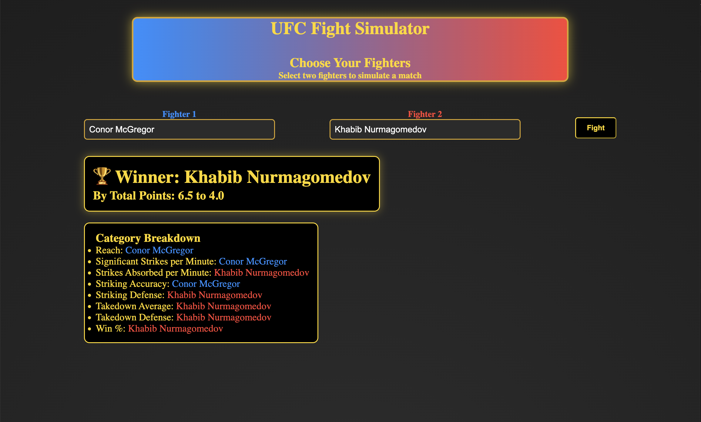

# UFC Fight Predictor
A UFC fight outcome predictor built with a React frontend and Flask backend.  
Features fighter search, matchup simulation, and result visualization.  
Includes a custom web scraper to collect and update fighter statistics used in predictions.

## Features

- Scrapes UFC fighter stats (height, reach, wins/losses, striking, grappling, etc.)
- Stores data in `fighters.csv`
- Simulates matchups between any two fighters
- Uses rule-based logic to predict winner and explain outcome

## Preview

### Web UI


*Example of the UFC Predictor web interface. Users can search fighters, simulate a matchup, and view the predicted winner along with explanation.*


## Files

- `scraper.py`: Scrapes and saves fighter stats to CSV  
- `preprocessor.py`: Loads and cleans data from CSV  
- `predictor.py`: Applies scoring logic to choose a winner  
- `simulate.py`: Orchestrates the prediction by name lookup + logic

## Usage

1. **Scrape Fighters**  
   ```bash
   python scraper.py
2. **Disclaimer:**
   Scraper will take 60-90 minutes to run

## Running the Application

To run the application, you need to start both the frontend and backend servers. Use two separate terminals for this:

### 1. Start the Backend Server
In the first terminal, navigate to the `backend` folder and run the following command:
```bash
python server.py
```

### 2. Start the frontend
In a second terminal navigate to the `frontend` folder and run the following:
```bash
npm run dev
```
This will start the frontend development server, once both are running open the browser and go to the URL provided by the frontend serve

## How Prediction Works

Each stat (e.g., Reach, SLpM, TD Accuracy) is compared:
- Fighter with the better value earns **+1 point**
- Fighter with the most points is predicted to **win**
- Ties are broken randomly, with a short explanation

## Requirements

- Python 3.7+
- Packages:
  - `requests`
  - `beautifulsoup4`
  - `pandas`

### Install Dependencies

```bash
pip install -r requirements.txt
```

---
Not affiliated with the UFC just for fun
